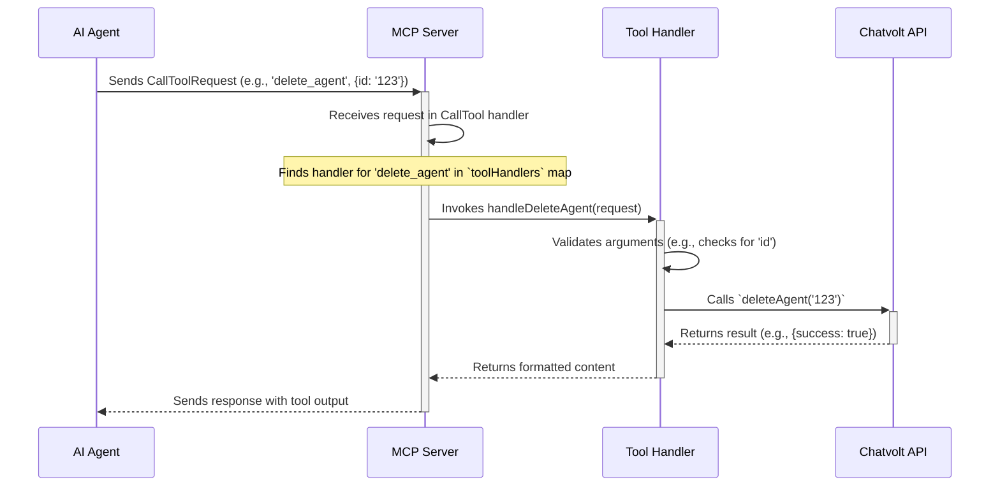

# Chatvolt MCP Server: High-Level Overview

This document provides a high-level overview of the Chatvolt Model Context Protocol (MCP) server, a TypeScript-based application designed to extend the capabilities of AI agents by providing them with a suite of tools to interact with the Chatvolt platform.

## Project Goal

The main goal of this project is to act as a bridge between an AI model and the Chatvolt API. It exposes a set of tools that an AI agent can call to perform actions such as managing agents, querying datastores, and handling CRM scenarios. This allows for the automation of complex workflows and provides a natural language interface to the Chatvolt platform.

## Key Technologies

*   **Node.js**: The runtime environment for the server.
*   **TypeScript**: The primary programming language, providing static typing and modern JavaScript features.
*   **@modelcontextprotocol/sdk**: The core SDK for building MCP servers, which simplifies the process of defining tools, resources, and handling requests from an AI model.

## Main Components

### 1. MCP Server ([`src/server.ts`](src/server.ts:1))

The core of the application is the MCP server, which is responsible for:
*   **Initializing the Server**: Sets up the server with its name, version, and capabilities.
*   **Handling Requests**: Implements handlers for various MCP request types, including `ListTools`, `CallTool`, `ListResources`, and `GetPrompt`.
*   **Tool Dispatching**: Receives `CallTool` requests and dispatches them to the appropriate tool handler.

### 2. Tools ([`src/tools/`](src/tools/))

The tools are the actions that the AI agent can perform. They are defined in the `src/tools/` directory and are broadly categorized into:
*   **Agent Management**: Tools for creating, updating, deleting, and listing Chatvolt agents.
*   **CRM Management**: Tools for managing CRM scenarios and steps.
*   **Datastore Management**: Tools for interacting with datastores and datasources.

### 3. Resources and Prompts

The server provides additional context to the AI model through resources and prompts:
*   **[`TOOL_DESCRIPTIONS.md`](TOOL_DESCRIPTIONS.md)**: A markdown file that provides detailed descriptions of all available tools and their parameters.
*   **[`MODELS.md`](MODELS.md)**: A list of the AI models that can be used with the agents.
*   **[`SYSTEM_PROMPTS.md`](SYSTEM_PROMPTS.md)**: Contains the system-level instructions that guide the AI agent.

---

# Setup and Installation

This guide will walk you through the process of setting up and running the project on your local machine.

## Prerequisites

Before you begin, ensure you have the following installed:

*   [Node.js](https://nodejs.org/) (which includes npm)

## Installation

1.  **Clone the repository:**

    ```bash
    git clone https://github.com/MiguelMartinezCV/chatvolt-mcp.git
    cd chatvolt-mcp
    ```

2.  **Install dependencies:**

    Run the following command to install the project's dependencies as defined in the [`package.json`](package.json:29) file. This will also automatically trigger the build process.

    ```bash
    npm install
    ```

## Building the Project

If you need to manually build the project (compile the TypeScript source code into JavaScript), you can run the following command. The `npm install` command already takes care of this for you.

```bash
npm run build
```

This command uses `tsc` to compile the files from `src` into the `build` directory.

## Running the Server

To run the server for development, you can use the watch script to automatically recompile on file changes:

```bash
npm run watch
```

In a separate terminal, to start and inspect the server, run:

```bash
npx @modelcontextprotocol/inspector build/index.js
```

This will start the Model Context Protocol server, and you can connect to it using an MCP inspector client.

---

# Chatvolt MCP Server: Detailed Architecture

This document provides a detailed technical architecture of the Chatvolt Model Context Protocol (MCP) server. It expands on the high-level overview, covering the request lifecycle, directory structure, and the process of defining and registering tools.

## 1. Request Lifecycle: `CallTool`

The `CallTool` request is the primary mechanism by which an AI agent executes an action. The lifecycle of this request is as follows:



**Flow Description:**

1.  **Request Reception:** The MCP server receives a `CallToolRequest`. This request is handled by the generic `CallToolRequestSchema` handler defined in [`src/server.ts`](src/server.ts:101).
2.  **Handler Dispatching:** The server looks up the specific tool handler from the `toolHandlers` object, which maps tool names (e.g., `"delete_agent"`) to their corresponding handler functions (e.g., `handleDeleteAgent`). This object is imported from the central `src/tools/` index file.
3.  **Tool Execution:** The matched handler function is executed. For example, [`handleDeleteAgent`](src/tools/deleteAgent.ts:22) in [`src/tools/deleteAgent.ts`](src/tools/deleteAgent.ts) is called.
4.  **Business Logic:** The tool handler extracts the necessary arguments from the request, validates them, and then calls the relevant function from the `src/services/` layer (e.g., `deleteAgent(id)`).
5.  **API Interaction:** The service function is responsible for making the actual API call to the Chatvolt platform.
6.  **Response Formatting:** The tool handler receives the data back from the service, stringifies it (in this case, as a JSON), and wraps it in the format expected by the MCP SDK.
7.  **Response Transmission:** The server sends the final, formatted content back to the AI agent that initiated the call.

## 2. Directory Structure

The project is organized to separate concerns, making it modular and maintainable.

*   **`src/`**: This is the root directory for all application source code.
*   **`src/tools/`**: This directory contains the implementation for each tool the server exposes.
    *   **Structure:** Each tool typically has its own file (e.g., [`deleteAgent.ts`](src/tools/deleteAgent.ts)).
    *   **Contents:** Each file exports two main constructs:
        1.  A `Tool` definition object (e.g., `deleteAgentTool`) that contains the tool's `name`, `description`, and `inputSchema` as required by the MCP SDK.
        2.  A handler function (e.g., `handleDeleteAgent`) that contains the logic for executing the tool.
    *   **Aggregation:** A central `index.js` file within this directory is responsible for importing all individual tools and handlers and exporting them as two aggregate objects: `tools` (an array of all tool definitions) and `toolHandlers` (a map of tool names to their handlers).
*   **`src/services/`**: This directory is intended to house the business logic and API client code that interacts with external services, primarily the Chatvolt API.
    *   **Purpose:** It acts as a bridge between the tool handlers and the underlying platform. This separation ensures that tool handlers are only responsible for request/response handling and argument validation, while the services layer manages the specifics of API communication.
    *   **Example:** The [`deleteAgent`](src/tools/deleteAgent.ts:2) function, imported from [`../services/chatvolt.js`](src/services/chatvolt.js), would contain the `fetch` call and logic required to send a `DELETE` request to the Chatvolt `/agents/:id` endpoint.

## 3. Tool Definition and Registration

Tools are the core components that define the server's capabilities. Their definition and registration follow a clear pattern:

1.  **Tool Definition:** Each tool is defined as a constant object of type `Tool` from the `@modelcontextprotocol/sdk/types.js` library. This object includes:
    *   `name`: A unique, machine-readable name for the tool (e.g., `"delete_agent"`).
    *   `description`: A human-readable description of what the tool does and its parameters. While a resource file like [`TOOL_DESCRIPTIONS.md`](TOOL_DESCRIPTIONS.md) exists to provide detailed documentation to the AI model, the `description` property within the tool definition itself serves as a concise summary.
    *   `inputSchema`: A JSON Schema object that formally defines the arguments the tool accepts, including their types and whether they are required.

2.  **Tool Registration:** The server discovers and registers tools through the following process:
    *   The `tools` array and `toolHandlers` map are imported from `src/tools/index.js` into [`src/server.ts`](src/server.ts:10).
    *   The `ListToolsRequestSchema` handler in [`src/server.ts`](src/server.ts:47) uses the imported `tools` array to respond to requests for the list of available tools.
    *   The `CallToolRequestSchema` handler uses the `toolHandlers` map to find and execute the correct function based on the `name` parameter in the incoming request.

This architecture creates a decoupled system where new tools can be easily added by creating a new file in the `src/tools/` directory and updating the central `index.js` file, without modifying the core server logic in [`src/server.ts`](src/server.ts).

---

# System Prompts Documentation

This document explains the role and content of system prompts used to guide the AI agent's behavior when interacting with the Chatvolt MCP (Model Context Protocol). These prompts are defined in the [`SYSTEM_PROMPTS.md`](SYSTEM_PROMPTS.md) file and provide a foundational set of instructions for the AI.

## Purpose of System Prompts

System prompts are high-level instructions that define the AI's persona, objectives, and operational constraints. They ensure the AI acts in a predictable and effective manner by establishing a clear framework for how it should interpret user requests, utilize its tools, and structure its responses.

## Key Instructions and Scenarios

The [`SYSTEM_PROMPTS.md`](SYSTEM_PROMPTS.md) file outlines three primary scenarios, each with a corresponding system prompt to guide the AI's behavior.

### 1. Simple Tool Operation

*   **Purpose**: To handle straightforward user requests that can be fulfilled by a single tool call.
*   **AI Persona**: An expert AI assistant for the Chatvolt platform.
*   **Core Instructions**:
    1.  Identify the user's intent.
    2.  Select the single, most appropriate tool (e.g., [`list_agents`](src/tools/listAgents.ts)).
    3.  Execute the tool with the correct parameters.
    4.  Report the outcome to the user.

### 2. Complex, Multi-Step Workflow

*   **Purpose**: To manage complex tasks that require a sequence of tool calls to achieve a larger goal.
*   **AI Persona**: A senior AI automation engineer responsible for orchestrating workflows.
*   **Core Instructions**:
    1.  **Deconstruct**: Break down the user's request into smaller, sequential steps.
    2.  **Plan**: Create a step-by-step plan, identifying the right tool for each step.
    3.  **Execute**: Call the tools sequentially, waiting for each one to complete successfully before proceeding to the next. The output of one tool can be used as input for another.
    4.  **Synthesize**: Provide a final summary of all actions taken and the result.

### 3. Self-Discovery and Learning

*   **Purpose**: To enable the AI to be resourceful and learn about its own capabilities before executing a task.
*   **AI Persona**: A highly autonomous and proactive AI agent.
*   **Core Instructions**:
    1.  **Self-Discovery First**: Before attempting a complex task, the AI **must** first call the `getDocumentation` tool to retrieve information about all its available tools.
    2.  **Analyze**: Review the documentation to understand its capabilities.
    3.  **Plan**: Formulate a plan based on the newly acquired knowledge of its tools.
    4.  **Execute**: Carry out the plan and report the outcome.

---

# API and Tool Reference

This document provides a detailed reference for the available tools that can be used to interact with the server.

---

## `create_agent`

Creates a new Chatvolt agent.

| Parameter | Type | Description |
| :--- | :--- | :--- |
| `name` | string, required | The name of the agent. This is a human-readable identifier for the agent. |
| `description` | string, required | A detailed description of the agent's purpose and capabilities. |
| `modelName` | string, required | The specific AI model the agent will use (e.g., 'gpt-4', 'claude_3_sonnet'). |
| `systemPrompt` | string, required | The initial instructions or context given to the agent to define its personality, role, and behavior. |
| `temperature` | number, optional | Controls the randomness of the model's output. A value closer to 0 makes the output more deterministic, while a value closer to 1 makes it more creative. |
| `tools` | array, optional | A list of tools that the agent can use to perform actions. |

---

## `update_agent`

Updates an existing agent's properties.

| Parameter | Type | Description |
| :--- | :--- | :--- |
| `id` | string, required | The unique identifier of the agent to be updated. |
| Other optional parameters | | Any other agent property can be provided to update its value. |

---

## `delete_agent`

Deletes a specified agent.

| Parameter | Type | Description |
| :--- | :--- | :--- |
| `id` | string, required | The unique identifier of the agent to be deleted. |

---

## `list_agents`

Retrieves a list of all available agents.

This tool takes no parameters.

---

## `get_agent`

Retrieves detailed information about a single agent.

| Parameter | Type | Description |
| :--- | :--- | :--- |
| `id` | string, required | The unique identifier of the agent to retrieve. |

---

## `agent_query`

Sends a query or message to an agent for processing.

| Parameter | Type | Description |
| :--- | :--- | :--- |
| `id` | string, required | The unique identifier of the agent that will receive the query. |
| `query` | string, required | The text of the question or command to be sent to the agent. |
| `conversationId` | string, optional | The identifier for an existing conversation. If provided, the query will be part of that conversation's history. |

---

## `enable_disable_agent_integration`

Enables or disables a specific integration for an agent.

| Parameter | Type | Description |
| :--- | :--- | :--- |
| `id` | string, required | The unique identifier of the agent. |
| `type` | string, required | The type of integration to modify (e.g., 'whatsapp', 'telegram'). |
| `enabled` | boolean, required | Set to `true` to enable the integration or `false` to disable it. |

---

## `create_crm_scenario`

Creates a new scenario within the CRM.

| Parameter | Type | Description |
| :--- | :--- | :--- |
| `name` | string, required | The name of the new CRM scenario. |
| `description` | string, optional | A description of the scenario's purpose. |

---

## `update_crm_scenario`

Updates an existing CRM scenario.

| Parameter | Type | Description |
| :--- | :--- | :--- |
| `id` | string, required | The unique identifier of the scenario to update. |
| `name` | string, required | The new name for the scenario. |
| `description` | string, optional | The new description for the scenario. |

---

## `delete_crm_scenario`

Deletes a CRM scenario.

| Parameter | Type | Description |
| :--- | :--- | :--- |
| `id` | string, required | The unique identifier of the scenario to delete. |

---

## `list_crm_scenarios`

Lists all CRM scenarios.

| Parameter | Type | Description |
| :--- | :--- | :--- |
| `agentId` | string, optional | If provided, filters the list to show only scenarios associated with this agent ID. |

---

## `create_crm_step`

Creates a new step within a CRM scenario.

| Parameter | Type | Description |
| :--- | :--- | :--- |
| `scenarioId` | string, required | The unique identifier of the scenario to which this step will be added. |
| `name` | string, required | The name of the new step. |

---

## `update_crm_step`

Updates an existing step in a CRM scenario.

| Parameter | Type | Description |
| :--- | :--- | :--- |
| `id` | string, required | The unique identifier of the step to update. |
| `name` | string, required | The new name for the step. |

---

## `delete_crm_step`

Deletes a step from a CRM scenario.

| Parameter | Type | Description |
| :--- | :--- | :--- |
| `id` | string, required | The unique identifier of the step to delete. |

---

## `list_crm_steps`

Lists all steps for a given CRM scenario.

| Parameter | Type | Description |
| :--- | :--- | :--- |
| `scenarioId` | string, required | The unique identifier of the scenario whose steps are to be listed. |

---

## `create_datastore`

Creates a new datastore.

| Parameter | Type | Description |
| :--- | :--- | :--- |
| `type` | string, required | The type of datastore to create (e.g., 'qdrant'). |
| `name` | string, optional | A name for the datastore. |
| `description` | string, optional | A description of the datastore's content or purpose. |

---

## `get_datastore`

Retrieves information about a specific datastore.

| Parameter | Type | Description |
| :--- | :--- | :--- |
| `id` | string, required | The unique identifier of the datastore to retrieve. |
| `search` | string, optional | A search term to find specific data within the datastore. |

---

## `list_datastores`

Retrieves a list of all datastores.

This tool takes no parameters.

---

## `create_datasource`

Creates a new data source within a datastore.

| Parameter | Type | Description |
| :--- | :--- | :--- |
| `datastoreId` | string, required | The unique identifier of the datastore where the data source will be created. |
| `name` | string, required | The name of the data source, often used as a filename. |
| `text` | string, required | The actual text content of the data source. |
